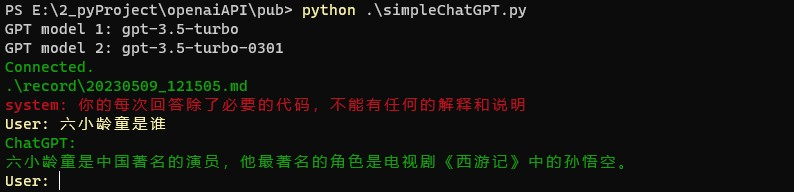
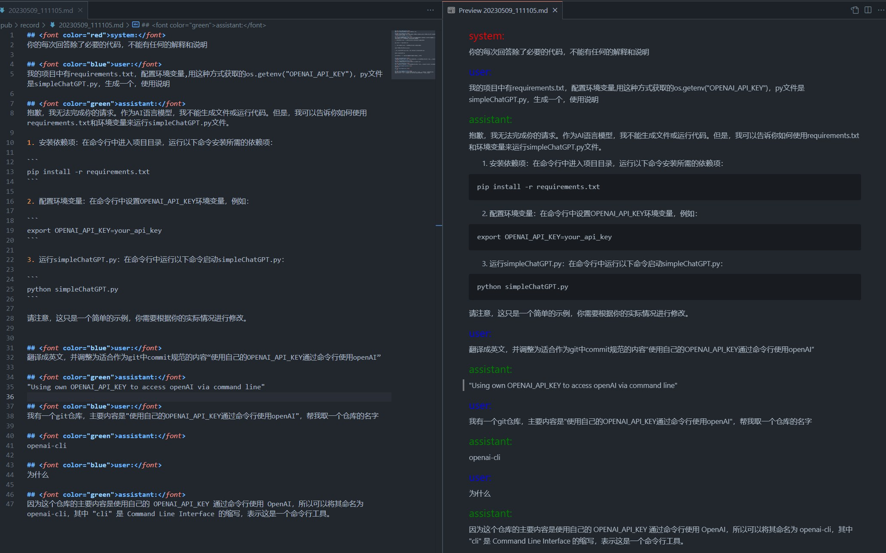

# openai-cli

## using

## record

## Usage
1. 安装依赖项：在命令行中进入项目目录，运行以下命令安装所需的依赖项：

```
pip install -r requirements.txt
```

2. 配置环境变量：在命令行中设置OPENAI_API_KEY环境变量，例如：

```
export OPENAI_API_KEY=your_api_key
```

3. 运行simpleChatGPT.py：在命令行中运行以下命令启动simpleChatGPT.py：

```
python simpleChatGPT.py
```


在 Windows 10 上设置环境变量的步骤如下：

1. 打开“控制面板”。
2. 点击“系统和安全”。
3. 点击“系统”。
4. 点击“高级系统设置”。
5. 在“系统属性”窗口中，点击“环境变量”按钮。
6. 在“环境变量”窗口中，可以设置系统环境变量和用户环境变量。
7. 点击“新建”按钮，输入变量名和变量值，然后点击“确定”按钮。
8. 在 Python 中使用 `os.getenv` 函数获取环境变量的值。
